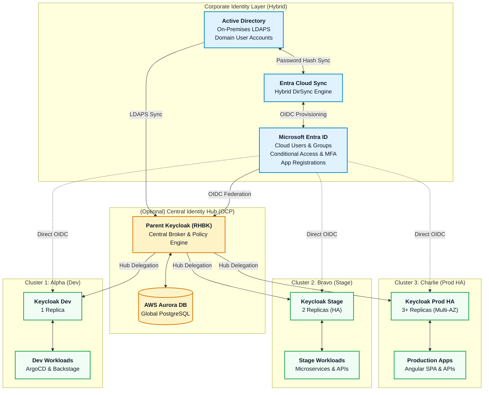
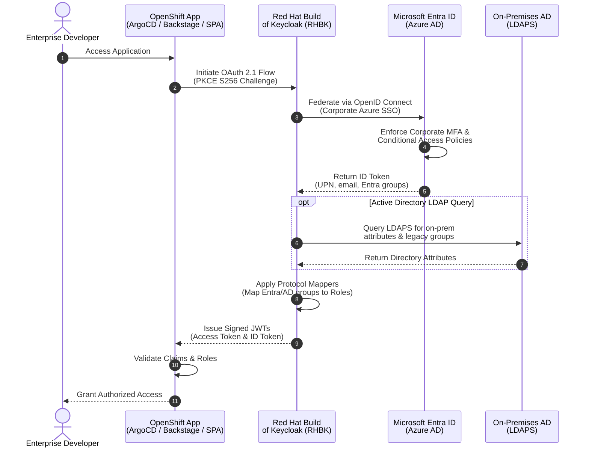
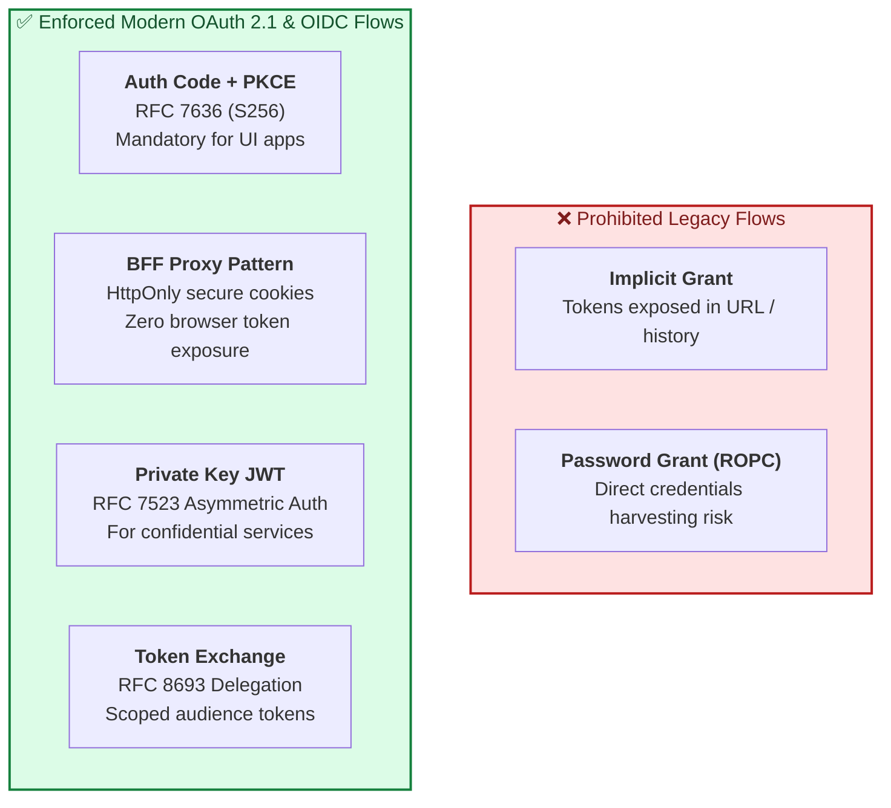
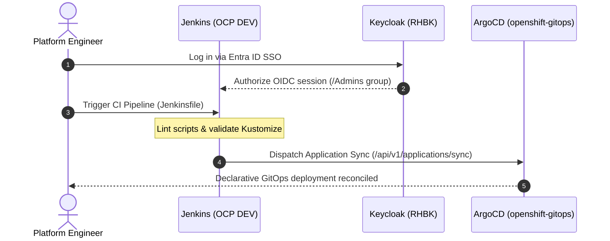
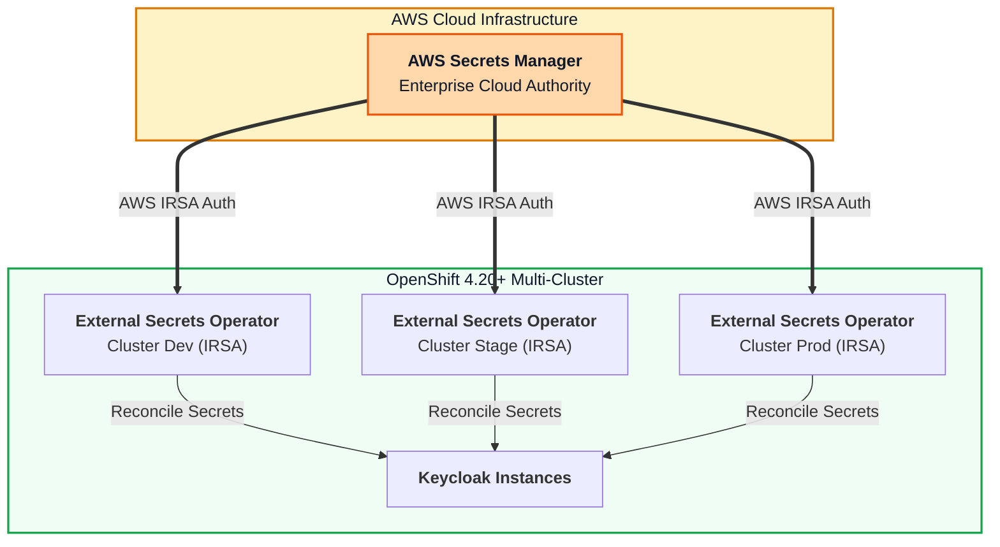

# Red Hat Build of Keycloak (RHBK) on OpenShift 4.20+ GitOps Architecture
### Enterprise Multi-Cluster Identity & Access Management with Microsoft Entra ID, Active Directory & OAuth 2.1

[](LICENSE)
[](https://docs.redhat.com/en/documentation/openshift_container_platform/4.20)
[](https://access.redhat.com/products/red-hat-build-of-keycloak)
[](https://datatracker.ietf.org/doc/html/draft-ietf-oauth-v2-1-11)
[](https://argo-cd.readthedocs.io/)
[](https://www.jenkins.io/)

---

> [!NOTE]
> **Generative AI Accelerator Disclaimer**
> This repository and all associated architectures, manifests, configurations, and scripts were generated with **Gemini 3.7 Flash High (Antigravity Agent)**.
> This content is intended as an illustrative, architectural reference and accelerator baseline. It has not been executed or validated in a live customer production environment. Platform engineering teams should review, profile, harden, and adapt these artifacts to their specific security policies, network topologies, and compliance mandates.

---

## Table of Contents

- [1. Executive Summary & Architecture Overview](#1-executive-summary--architecture-overview)
- [2. Multi-Cluster Topology (3 AWS OCP Clusters + Central Hub)](#2-multi-cluster-topology-3-aws-ocp-clusters--central-hub)
- [3. Hybrid Identity Architecture: Microsoft Entra ID & Active Directory](#3-hybrid-identity-architecture-microsoft-entra-id--active-directory)
- [4. Modern OAuth 2.1 & OpenID Connect Security Paradigm](#4-modern-oauth-21--openid-connect-security-paradigm)
- [5. Comparative Matrices & Architectural Decision Records](#5-comparative-matrices--architectural-decision-records)
  - [5.1 Identity Integration Patterns Matrix](#51-identity-integration-patterns-matrix)
  - [5.2 Client Types & OAuth 2.1 Security Profiles Matrix](#52-client-types--oauth-21-security-profiles-matrix)
  - [5.3 Cluster Environment Matrix](#53-cluster-environment-matrix)
  - [5.4 Lifecycle Operations Matrix (Day 0 to Decommissioning)](#54-lifecycle-operations-matrix-day-0-to-decommissioning)
  - [5.5 Secrets Management: AWS Secrets Manager vs. HashiCorp Vault Matrix](#55-secrets-management-aws-secrets-manager-vs-hashicorp-vault-matrix)
- [6. Step-by-Step Operations Guide](#6-step-by-step-operations-guide)
  - [6.1 Day 0: Infrastructure Prerequisites, TLS & Network Policies](#61-day-0-infrastructure-prerequisites-tls--network-policies)
  - [6.2 Day 1: GitOps Operator Provisioning & Declarative Realms](#62-day-1-gitops-operator-provisioning--declarative-realms)
  - [6.3 Day 2: Maintenance, Backups, Autoscaling & Observability](#63-day-2-maintenance-backups-autoscaling--observability)
  - [6.4 Decommissioning: Graceful Teardown & Secret Shredding](#64-decommissioning-graceful-teardown--secret-shredding)
- [7. Sample Applications & Enterprise Workload Integrations](#7-sample-applications--enterprise-workload-integrations)
  - [7.1 ArgoCD GitOps UI (OIDC Auth Code + PKCE & Group RBAC)](#71-argocd-gitops-ui-oidc-auth-code--pkce--group-rbac)
  - [7.2 Backstage Developer Portal (IDP Provider & Catalog Sync)](#72-backstage-developer-portal-idp-provider--catalog-sync)
  - [7.3 Enterprise Angular 18+ SPA (PKCE & BFF Gateway Pattern)](#73-enterprise-angular-18-spa-pkce--bff-gateway-pattern)
  - [7.4 Quarkus Microservice (JWT Resource Server & Token Exchange RFC 8693)](#74-quarkus-microservice-jwt-resource-server--token-exchange-rfc-8693)
  - [7.5 Node.js API Gateway (Private Key JWT RFC 7523 & JWKS Validation)](#75-nodejs-api-gateway-private-key-jwt-rfc-7523--jwks-validation)
- [8. Jenkins CI/CD on OpenShift DEV (Helm Chart + OIDC + ArgoCD)](#8-jenkins-cicd-on-openshift-dev-helm-chart--oidc--argocd)
- [9. Secrets Management Architecture (AWS Secrets Manager + HashiCorp Vault + ESO)](#9-secrets-management-architecture-aws-secrets-manager--hashicorp-vault--eso)
- [10. Zero-Trust Security: OpenShift EgressFirewall](#10-zero-trust-security-openshift-egressfirewall)
- [11. Local Sandbox Environment (Offline Testing Stack)](#11-local-sandbox-environment-offline-testing-stack)
- [12. Developer Makefile Reference](#12-developer-makefile-reference)
- [13. Observability, Prometheus Metrics & Grafana Dashboards](#13-observability-prometheus-metrics--grafana-dashboards)
- [14. Disaster Recovery & Multi-Region Cross-Site Replication](#14-disaster-recovery--multi-region-cross-site-replication)
- [15. Verification & End-to-End Validation](#15-verification--end-to-end-validation)
- [16. Up-to-Date References & Standards (2026)](#16-up-to-date-references--standards-2026)

---

## 1. Executive Summary & Architecture Overview

Modern enterprise identity architectures require a balance between centralized governance and distributed high availability. This repository provides a complete, declarative GitOps foundation for deploying **Red Hat Build of Keycloak (RHBK)** on **OpenShift Container Platform (OCP) 4.20+** hosted on Amazon Web Services (AWS).

### Key Architectural Pillars
1. **Red Hat Build of Keycloak Operator (Quarkus Engine)**: Replaces legacy WildFly-based RHSSO 7.x with modern Quarkus-powered Keycloak (v24/v26 stream) for fast startup, low memory footprint (~1.5GB/instance), and full declarative reconciliation.
2. **Hybrid Corporate Identity**: Bridges cloud-native **Microsoft Entra ID (Azure AD)** and on-premises **Active Directory** via OIDC Identity Brokering and LDAPS User Federation with bidirectional group mappings.
3. **Strict OAuth 2.1 Compliance**: Deprecates insecure legacy flows (Implicit Grant and Resource Owner Password Credentials) and enforces **Authorization Code Flow with PKCE (RFC 7636)**, **Backend-For-Frontend (BFF)** proxying, **Private Key JWT (RFC 7523)**, and **Token Exchange (RFC 8693)**.
4. **GitOps-First Automation**: Powered by ArgoCD ApplicationSets and Kustomize overlays for automated multi-cluster rollout across Development (`cluster-alpha-dev`), Staging (`cluster-bravo-stage`), Production HA (`cluster-charlie-prod`), and an optional Central Management Hub (`cluster-hub-central`).
5. **Continuous Integration & Secrets Management**: Jenkins deployed via official Helm chart on OpenShift DEV, federated with Keycloak OIDC, triggering ArgoCD GitOps syncs, with secrets synchronized via **External Secrets Operator (ESO)** from **AWS Secrets Manager** and **HashiCorp Vault**.

---

## 2. Multi-Cluster Topology (3 AWS OCP Clusters + Central Hub)



---

## 3. Hybrid Identity Architecture: Microsoft Entra ID & Active Directory

Enterprise organizations typically host core user identities in Microsoft Entra ID (Azure AD) and on-premises Active Directory Domain Services (AD DS). Keycloak acts as the OpenShift-native Identity Provider (IdP) Broker and Token Authority.



---

## 4. Modern OAuth 2.1 & OpenID Connect Security Paradigm

OAuth 2.1 consolidates security best practices developed over a decade of OAuth 2.0 deployments.



---

## 5. Comparative Matrices & Architectural Decision Records

### 5.1 Identity Integration Patterns Matrix

| Pattern | Mechanism | Use Case | Latency | Resilience | Complexity |
| :--- | :--- | :--- | :--- | :--- | :--- |
| **OIDC Identity Brokering** | Keycloak -> Microsoft Entra ID OIDC | Cloud-first users, Microsoft 365, Azure Conditional Access | Low (<150ms) | Dependent on Entra ID availability | Low (standard OIDC) |
| **LDAPS User Federation** | Keycloak -> On-Prem AD (LDAPS:636) | Legacy on-prem AD users, Kerberos ticket exchange | Medium (<300ms) | Local caching reduces WAN reliance | Medium (LDAP schema mappers) |
| **Hybrid Hub-Spoke** | Spoke Keycloak -> Parent Hub Keycloak -> Entra ID | Multi-cluster enterprise governance with regional failover | Low-Medium | High (regional offline caches) | High (multi-tier federation) |

### 5.2 Client Types & OAuth 2.1 Security Profiles Matrix

| Client Application | Client Type | Authentication Method | Grant Type | PKCE Method | Token Lifespan |
| :--- | :--- | :--- | :--- | :--- | :--- |
| **ArgoCD GitOps** | Confidential | `client_secret` / `private_key_jwt` | Authorization Code | `S256` | 15 mins (Refreshable) |
| **Backstage IDP** | Confidential | `client_secret` + Service Account | Authorization Code | `S256` | 30 mins |
| **Angular 18+ SPA** | Public / BFF | `none` (with PKCE) or BFF Cookie | Authorization Code | `S256` | 5 mins (Short-lived) |
| **API Gateway** | Confidential | `private_key_jwt` (RFC 7523) | Client Credentials | N/A (Server-to-Server) | 10 mins |
| **Quarkus Microservice** | Bearer-only / Service | `client_secret` / mTLS | Token Exchange (RFC 8693) | N/A | 5 mins (Scoped audience) |

### 5.3 Cluster Environment Matrix

| Parameter | Dev Cluster (`cluster-alpha-dev`) | Stage Cluster (`cluster-bravo-stage`) | Prod HA Cluster (`cluster-charlie-prod`) | Hub Cluster (`cluster-hub-central`) |
| :--- | :--- | :--- | :--- | :--- |
| **Replicas** | 1 | 2 | 3 to 10 (HPA enabled) | 3 (Multi-AZ) |
| **CPU / Memory Req** | 500m / 1024Mi | 1000m / 1536Mi | 2000m / 2048Mi | 2000m / 2048Mi |
| **CPU / Memory Limit**| 1000m / 2048Mi | 2000m / 3072Mi | 4000m / 4096Mi | 4000m / 4096Mi |
| **Database Tier** | PostgreSQL Single-Pod | Crunchy PGO HA (2 instances) | AWS Aurora PostgreSQL Multi-AZ | AWS Aurora Multi-Region |
| **Hostname** | `keycloak-dev.apps.cluster-alpha...` | `keycloak-stage.apps.cluster-bravo...` | `sso.enterprise.example.com` | `sso-hub.enterprise.example.com` |

### 5.4 Lifecycle Operations Matrix (Day 0 to Decommissioning)

| Phase | Scope | Primary Automation Tool | Key Deliverables |
| :--- | :--- | :--- | :--- |
| **Day 0** | Prerequisites & Infra | `scripts/day0-prereqs.sh` | Namespace, TLS certs, DB secrets, NetworkPolicies |
| **Day 1** | Provisioning & IdP Config | `scripts/day1-*.sh` + GitOps | Operator CSV, Keycloak CR, Declarative Realm Imports |
| **Day 2** | Maintenance & Ops | `scripts/day2-operations-suite.sh` | DB backups, Realm exports, Prometheus metrics, HPA, Upgrades |
| **Decom** | Teardown & Archival | `scripts/decommission-cluster.sh` | Final DB/Realm snapshot, route removal, resource shredding |

### 5.5 Secrets Management: AWS Secrets Manager vs. HashiCorp Vault Matrix

| Feature | AWS Secrets Manager + ESO *(Recommended)* | HashiCorp Vault Hub-Spoke (PR) | In-Cluster Vault + ESO |
| :--- | :--- | :--- | :--- |
| **Multi-Cluster Sync** | Native AWS IAM / STS across clusters | Requires Vault Enterprise license | ESO pulls from central AWS Secrets |
| **Operational Effort** | Zero state (Managed AWS service) | High (Consensus, unsealing, WAN links) | Medium (Standalone instance) |
| **Auth Mechanism** | AWS IRSA (IAM Roles for Service Accounts) | Token / AppRole / Kubernetes Auth | Kubernetes ServiceAccount Auth |
| **Best For** | AWS OpenShift Clusters (ROSA / IPI) | Heterogeneous multi-cloud enterprises | Local Transit encryption & dynamic DB |

---

## 6. Step-by-Step Operations Guide

### 6.1 Day 0: Infrastructure Prerequisites, TLS & Network Policies
Execute Day 0 preparation on the target OpenShift cluster:
```bash
./scripts/day0-prereqs.sh
```

### 6.2 Day 1: GitOps Operator Provisioning & Declarative Realms
Deploy the Red Hat Build of Keycloak Operator and provision the instance:
```bash
# For Dev Cluster
./scripts/day1-deploy-operator-and-keycloak.sh cluster-alpha-dev

# For Production Cluster
./scripts/day1-deploy-operator-and-keycloak.sh cluster-charlie-prod
```
Next, configure Microsoft Entra ID and Active Directory federation:
```bash
ENTRA_TENANT_ID="<your-tenant-uuid>" \
ENTRA_CLIENT_ID="<your-app-client-uuid>" \
ENTRA_CLIENT_SECRET="<your-client-secret>" \
./scripts/day1-configure-entra-federation.sh
```
Finally, register sample applications (ArgoCD, Backstage, Angular SPA, Microservices):
```bash
./scripts/day1-register-sample-apps.sh
```

### 6.3 Day 2: Maintenance, Backups, Autoscaling & Observability
Launch the interactive Day 2 operations suite:
```bash
./scripts/day2-operations-suite.sh
```

### 6.4 Decommissioning: Graceful Teardown & Secret Shredding
When decommissioning a cluster or tearing down a testing environment:
```bash
./scripts/decommission-cluster.sh
```

---

## 7. Sample Applications & Enterprise Workload Integrations

- **ArgoCD GitOps**: [`apps/argocd/`](apps/argocd/) (OIDC configuration + group RBAC).
- **Backstage Developer Portal**: [`apps/backstage-idp/`](apps/backstage-idp/) (App config + backend auth plugin).
- **Angular 18+ Single Page App**: [`apps/angular-spa/`](apps/angular-spa/) (AuthCode PKCE service, standalone UI, BFF OAuth2-Proxy / Nginx config).
- **Quarkus Microservice**: [`apps/microservices/quarkus-api-service/`](apps/microservices/quarkus-api-service/) (SmallRye JWT, RFC 8693 Token Exchange).
- **Node.js API Gateway**: [`apps/microservices/nodejs-api-gateway/`](apps/microservices/nodejs-api-gateway/) (Express, `jose` JWT validation, Private Key JWT RFC 7523).

---

## 8. Jenkins CI/CD on OpenShift DEV (Helm Chart + OIDC + ArgoCD)

The **`ci-cd/jenkins/`** module configures Jenkins on OpenShift DEV using the official Helm chart:
- **Helm Values**: [`ci-cd/jenkins/values-openshift.yaml`](ci-cd/jenkins/values-openshift.yaml) configured with OpenShift SCC compatibility, persistent storage, and dynamic Kubernetes agent clouds.
- **Keycloak OIDC JCasC**: [`ci-cd/jenkins/jenkins-keycloak-oidc-jcasc.yaml`](ci-cd/jenkins/jenkins-keycloak-oidc-jcasc.yaml) mapping Keycloak `/Admins` and `/Developers` groups to matrix permissions.
- **Jenkins Pipeline**: [`ci-cd/jenkins/Jenkinsfile`](ci-cd/jenkins/Jenkinsfile) executing automated Kustomize checks and triggering ArgoCD application synchronization.



---

## 9. Secrets Management Architecture (AWS Secrets Manager + HashiCorp Vault + ESO)

Detailed architecture guide available in [`docs/SECRETS_MANAGEMENT_VAULT_AWS.md`](docs/SECRETS_MANAGEMENT_VAULT_AWS.md).



---

## 10. Zero-Trust Security: OpenShift EgressFirewall

Configured in [`gitops/base/networking/egress-firewall.yaml`](gitops/base/networking/egress-firewall.yaml) to restrict outbound traffic from Keycloak pods:
- **Allowed**: `login.microsoftonline.com`, `graph.microsoft.com`, AWS STS, AWS Secrets Manager, and on-premises LDAPS CIDR.
- **Blocked**: All other outbound internet ranges (`0.0.0.0/0`) are denied at the kernel level.

---

## 11. Local Sandbox Environment (Offline Testing Stack)

Start the complete offline development and testing stack locally via Docker Compose:
```bash
# 1-Click Startup Script
./scripts/local-sandbox-up.sh
```
Stack includes:
- Keycloak 24/26 on `http://localhost:8080` (admin/admin).
- OpenLDAP on `ldap://localhost:389` with pre-seeded AD users (`john.doe`, `jane.admin`).
- PostgreSQL 16 on port `5432`.
- Node.js API Gateway on `http://localhost:8085`.
- Angular 18+ SPA on `http://localhost:4200`.

---

## 12. Developer Makefile Reference

| Command | Description |
| :--- | :--- |
| `make lint` | Runs `bash -n` syntax validation on all shell scripts |
| `make validate` | Validates all Kustomize overlays across all cluster environments |
| `make test-oauth2` | Executes end-to-end OAuth 2.1 / OIDC protocol test suite |
| `make day0` | Provisions Day 0 prerequisites, TLS certs, and NetworkPolicies |
| `make day1-dev` | Deploys Operator and Keycloak to Dev cluster |
| `make day1-prod` | Deploys Operator and Keycloak HA to Prod cluster |
| `make day2` | Opens Day 2 interactive maintenance and operations CLI |
| `make local-up` | Starts local Docker Compose offline development stack |
| `make local-down` | Stops local Docker Compose offline stack |

---

## 13. Observability, Prometheus Metrics & Grafana Dashboards

- **ServiceMonitor**: [`gitops/base/monitoring/servicemonitor.yaml`](gitops/base/monitoring/servicemonitor.yaml)
- **Grafana Dashboard**: [`monitoring/dashboards/keycloak-quarkus-dashboard.json`](monitoring/dashboards/keycloak-quarkus-dashboard.json)
- **Prometheus SLO Rules**: [`monitoring/alerts/keycloak-prometheus-alerts.yaml`](monitoring/alerts/keycloak-prometheus-alerts.yaml)

---

## 14. Disaster Recovery & Multi-Region Cross-Site Replication

Detailed guide available in [`docs/DISASTER_RECOVERY_CROSS_SITE.md`](docs/DISASTER_RECOVERY_CROSS_SITE.md):
- Active-Active vs Active-Passive topologies.
- JGroups RELAY2 Infinispan session mirroring.
- AWS Route 53 Application Recovery Controller (ARC) automated DNS routing.

---

## 15. Verification & End-to-End Validation

```bash
./scripts/validate-oauth2-flows.sh
```

---

## 16. Up-to-Date References & Standards (2026)

### Official Red Hat & OpenShift Documentation
- [Red Hat Build of Keycloak Documentation](https://access.redhat.com/documentation/en-us/red_hat_build_of_keycloak)
- [Red Hat OpenShift 4.20 Release Notes & Security Guides](https://docs.redhat.com/en/documentation/openshift_container_platform/4.20)
- [OpenShift GitOps (ArgoCD) Documentation](https://docs.redhat.com/en/documentation/red_hat_openshift_gitops)

### Keycloak & Quarkus Core
- [Keycloak Official Documentation (Quarkus Server)](https://www.keycloak.org/documentation)
- [Keycloak High Availability & Cross-Site Guide](https://www.keycloak.org/high-availability/introduction)
- [Keycloak Securing Applications and Services Guide](https://www.keycloak.org/docs/latest/securing_apps/)

### OAuth 2.1 & IETF Security RFCs
- [IETF RFC 7636: Proof Key for Code Exchange (PKCE) by OAuth Public Clients](https://datatracker.ietf.org/doc/html/rfc7636)
- [IETF RFC 7523: JSON Web Token (JWT) Profile for OAuth 2.0 Client Authentication](https://datatracker.ietf.org/doc/html/rfc7523)
- [IETF RFC 8693: OAuth 2.0 Token Exchange](https://datatracker.ietf.org/doc/html/rfc8693)
- [IETF RFC 8705: OAuth 2.0 Mutual-TLS Client Authentication and Certificate-Bound Access Tokens](https://datatracker.ietf.org/doc/html/rfc8705)
- [IETF RFC 9449: OAuth 2.0 Demonstrating Proof-of-Possession (DPoP)](https://datatracker.ietf.org/doc/html/rfc9449)
- [OAuth 2.1 Draft Specification (IETF OAuth WG)](https://datatracker.ietf.org/doc/html/draft-ietf-oauth-v2-1-11)
- [OAuth 2.0 Security Best Current Practice (BCP)](https://datatracker.ietf.org/doc/html/draft-ietf-oauth-security-topics)

### Microsoft Entra ID & Active Directory
- [Microsoft Entra ID OpenID Connect Authentication](https://learn.microsoft.com/en-us/entra/identity-platform/v2-protocols-oidc)
- [Microsoft Entra ID Group Claims and App Roles](https://learn.microsoft.com/en-us/entra/identity-platform/optional-claims)
- [Microsoft Entra Cloud Sync Architecture](https://learn.microsoft.com/en-us/entra/identity/hybrid/cloud-sync/what-is-cloud-sync)
