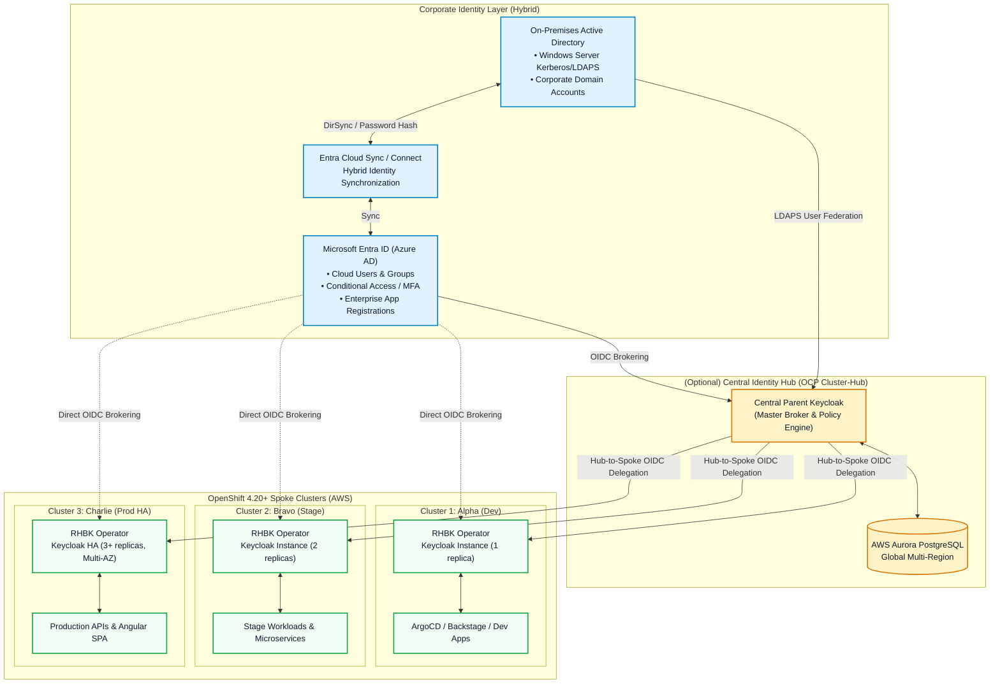
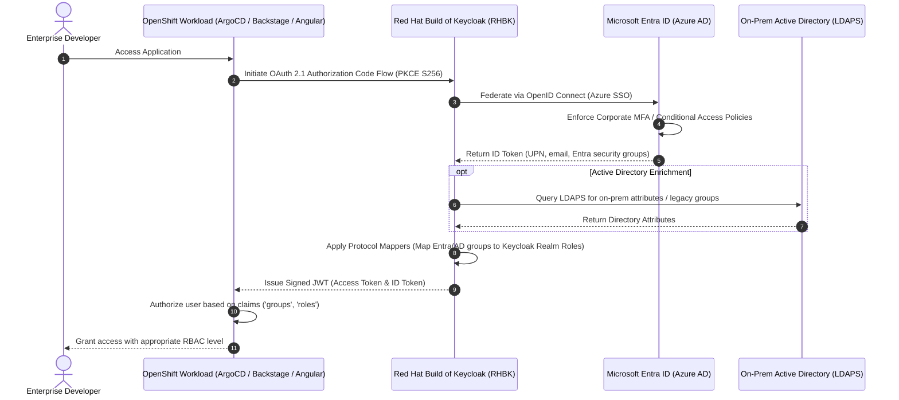
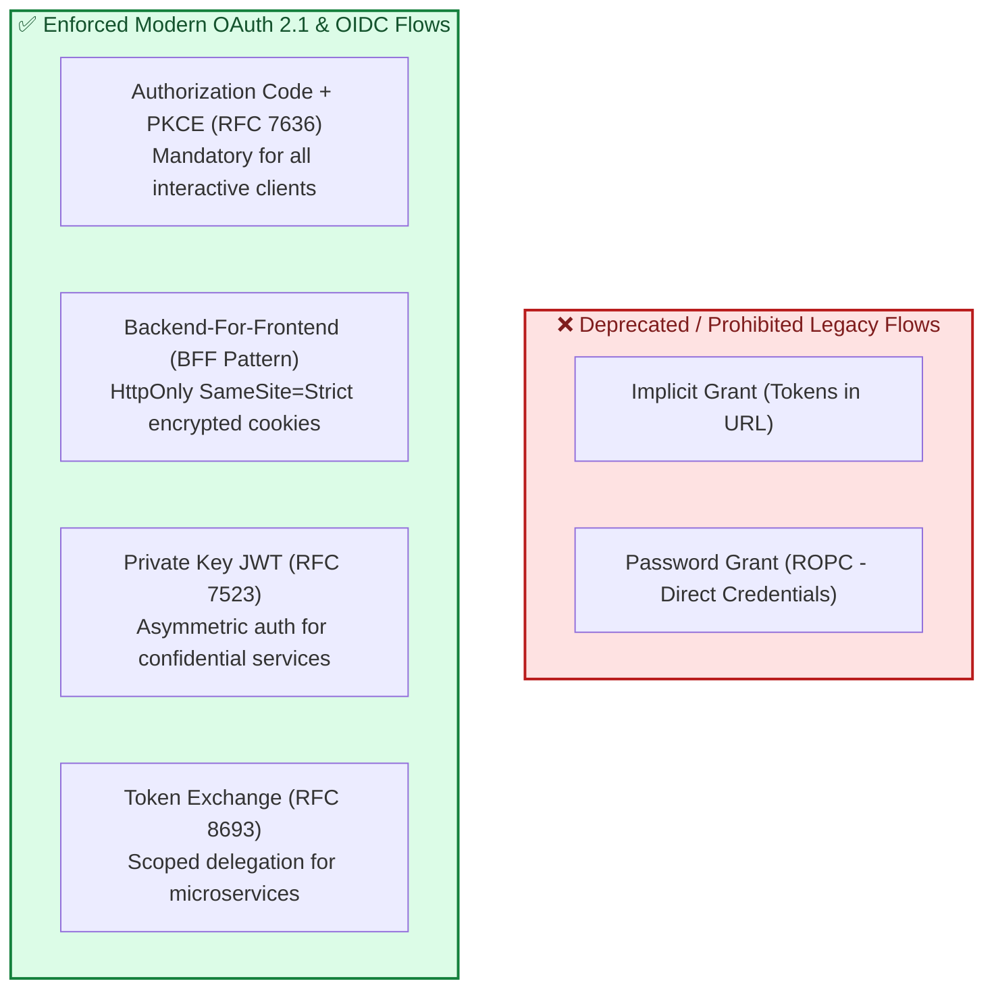

# Red Hat Build of Keycloak (RHBK) on OpenShift 4.20+ GitOps Architecture
### Enterprise Multi-Cluster Identity & Access Management with Microsoft Entra ID, Active Directory & OAuth 2.1

[](LICENSE)
[](https://docs.redhat.com/en/documentation/openshift_container_platform/4.20)
[](https://access.redhat.com/products/red-hat-build-of-keycloak)
[](https://datatracker.ietf.org/doc/html/draft-ietf-oauth-v2-1-11)
[](https://argo-cd.readthedocs.io/)

---

> [!NOTE]
> **Generative AI Accelerator Disclaimer**
> This repository and all associated architectures, manifests, configurations, and scripts were generated with **Gemini 3.7 Flash High (Antigravity Agent)**.
> This content is intended as an illustrative, architectural reference and accelerator baseline. It has not been executed or validated in a live customer production environment. Platform engineering teams should review, profile, harden, and adapt these artifacts to their specific security policies, network topologies, and compliance mandates.

---

## Table of Contents

- [1. Executive Summary & Architecture Overview](#1-executive-summary--architecture-overview)
- [2. Multi-Cluster Topology (3 AWS OCP Clusters + Central Hub)](#2-multi-cluster-topology-3-aws-ocp-clusters--central-hub)
- [3. Hybrid Identity Architecture: Microsoft Entra ID & Active Directory](#3-hybrid-identity-architecture-microsoft-entra-id--active-directory)
- [4. Modern OAuth 2.1 & OpenID Connect Security Paradigm](#4-modern-oauth-21--openid-connect-security-paradigm)
- [5. Comparative Matrices & Architectural Decision Records](#5-comparative-matrices--architectural-decision-records)
  - [5.1 Identity Integration Patterns Matrix](#51-identity-integration-patterns-matrix)
  - [5.2 Client Types & OAuth 2.1 Security Profiles Matrix](#52-client-types--oauth-21-security-profiles-matrix)
  - [5.3 Cluster Environment Matrix](#53-cluster-environment-matrix)
  - [5.4 Lifecycle Operations Matrix (Day 0 to Decommissioning)](#54-lifecycle-operations-matrix-day-0-to-decommissioning)
- [6. Step-by-Step Operations Guide](#6-step-by-step-operations-guide)
  - [6.1 Day 0: Infrastructure Prerequisites, TLS & Network Policies](#61-day-0-infrastructure-prerequisites-tls--network-policies)
  - [6.2 Day 1: GitOps Operator Provisioning & Declarative Realms](#62-day-1-gitops-operator-provisioning--declarative-realms)
  - [6.3 Day 2: Maintenance, Backups, Autoscaling & Observability](#63-day-2-maintenance-backups-autoscaling--observability)
  - [6.4 Decommissioning: Graceful Teardown & Secret Shredding](#64-decommissioning-graceful-teardown--secret-shredding)
- [7. Sample Applications & Enterprise Workload Integrations](#7-sample-applications--enterprise-workload-integrations)
  - [7.1 ArgoCD GitOps UI (OIDC Auth Code + PKCE & Group RBAC)](#71-argocd-gitops-ui-oidc-auth-code--pkce--group-rbac)
  - [7.2 Backstage Developer Portal (IDP Provider & Catalog Sync)](#72-backstage-developer-portal-idp-provider--catalog-sync)
  - [7.3 Enterprise Angular 18+ SPA (PKCE & BFF Gateway Pattern)](#73-enterprise-angular-18-spa-pkce--bff-gateway-pattern)
  - [7.4 Quarkus Microservice (JWT Resource Server & Token Exchange RFC 8693)](#74-quarkus-microservice-jwt-resource-server--token-exchange-rfc-8693)
  - [7.5 Node.js API Gateway (Private Key JWT RFC 7523 & JWKS Validation)](#75-nodejs-api-gateway-private-key-jwt-rfc-7523--jwks-validation)
- [8. Automation Scripts Reference (CLI Tooling)](#8-automation-scripts-reference-cli-tooling)
- [9. Observability, Prometheus Metrics & Grafana Dashboards](#9-observability-prometheus-metrics--grafana-dashboards)
- [10. Verification & End-to-End Validation](#10-verification--end-to-end-validation)
- [11. Up-to-Date References & Standards (2026)](#11-up-to-date-references--standards-2026)

---

## 1. Executive Summary & Architecture Overview

Modern enterprise identity architectures require a balance between centralized governance and distributed high availability. This repository provides a complete, declarative GitOps foundation for deploying **Red Hat Build of Keycloak (RHBK)** on **OpenShift Container Platform (OCP) 4.20+** hosted on Amazon Web Services (AWS).

### Key Architectural Pillars
1. **Red Hat Build of Keycloak Operator (Quarkus Engine)**: Replaces legacy WildFly-based RHSSO 7.x with modern Quarkus-powered Keycloak (v24/v26 stream) for fast startup, low memory footprint (~1.5GB/instance), and full declarative reconciliation.
2. **Hybrid Corporate Identity**: Bridges cloud-native **Microsoft Entra ID (Azure AD)** and on-premises **Active Directory** via OIDC Identity Brokering and LDAPS User Federation with bidirectional group mappings.
3. **Strict OAuth 2.1 Compliance**: Deprecates insecure legacy flows (Implicit Grant and Resource Owner Password Credentials) and enforces **Authorization Code Flow with PKCE (RFC 7636)**, **Backend-For-Frontend (BFF)** proxying, **Private Key JWT (RFC 7523)**, and **Token Exchange (RFC 8693)**.
4. **GitOps-First Automation**: Powered by ArgoCD ApplicationSets and Kustomize overlays for automated multi-cluster rollout across Development (`cluster-alpha-dev`), Staging (`cluster-bravo-stage`), Production HA (`cluster-charlie-prod`), and an optional Central Management Hub (`cluster-hub-central`).

---

## 2. Multi-Cluster Topology (3 AWS OCP Clusters + Central Hub)



---

## 3. Hybrid Identity Architecture: Microsoft Entra ID & Active Directory

Enterprise organizations typically host core user identities in Microsoft Entra ID (Azure AD) and on-premises Active Directory Domain Services (AD DS). Keycloak acts as the OpenShift-native Identity Provider (IdP) Broker and Token Authority.



---

## 4. Modern OAuth 2.1 & OpenID Connect Security Paradigm

OAuth 2.1 consolidates security best practices developed over a decade of OAuth 2.0 deployments.



---

## 5. Comparative Matrices & Architectural Decision Records

### 5.1 Identity Integration Patterns Matrix

| Pattern | Mechanism | Use Case | Latency | Resilience | Complexity |
| :--- | :--- | :--- | :--- | :--- | :--- |
| **OIDC Identity Brokering** | Keycloak -> Microsoft Entra ID OIDC | Cloud-first users, Microsoft 365, Azure Conditional Access | Low (<150ms) | Dependent on Entra ID availability | Low (standard OIDC) |
| **LDAPS User Federation** | Keycloak -> On-Prem AD (LDAPS:636) | Legacy on-prem AD users, Kerberos ticket exchange | Medium (<300ms) | Local caching reduces WAN reliance | Medium (LDAP schema mappers) |
| **Hybrid Hub-Spoke** | Spoke Keycloak -> Parent Hub Keycloak -> Entra ID | Multi-cluster enterprise governance with regional failover | Low-Medium | High (regional offline caches) | High (multi-tier federation) |

### 5.2 Client Types & OAuth 2.1 Security Profiles Matrix

| Client Application | Client Type | Authentication Method | Grant Type | PKCE Method | Token Lifespan |
| :--- | :--- | :--- | :--- | :--- | :--- |
| **ArgoCD GitOps** | Confidential | `client_secret` / `private_key_jwt` | Authorization Code | `S256` | 15 mins (Refreshable) |
| **Backstage IDP** | Confidential | `client_secret` + Service Account | Authorization Code | `S256` | 30 mins |
| **Angular 18+ SPA** | Public / BFF | `none` (with PKCE) or BFF Cookie | Authorization Code | `S256` | 5 mins (Short-lived) |
| **API Gateway** | Confidential | `private_key_jwt` (RFC 7523) | Client Credentials | N/A (Server-to-Server) | 10 mins |
| **Quarkus Microservice** | Bearer-only / Service | `client_secret` / mTLS | Token Exchange (RFC 8693) | N/A | 5 mins (Scoped audience) |

### 5.3 Cluster Environment Matrix

| Parameter | Dev Cluster (`cluster-alpha-dev`) | Stage Cluster (`cluster-bravo-stage`) | Prod HA Cluster (`cluster-charlie-prod`) | Hub Cluster (`cluster-hub-central`) |
| :--- | :--- | :--- | :--- | :--- |
| **Replicas** | 1 | 2 | 3 to 10 (HPA enabled) | 3 (Multi-AZ) |
| **CPU / Memory Req** | 500m / 1024Mi | 1000m / 1536Mi | 2000m / 2048Mi | 2000m / 2048Mi |
| **CPU / Memory Limit**| 1000m / 2048Mi | 2000m / 3072Mi | 4000m / 4096Mi | 4000m / 4096Mi |
| **Database Tier** | PostgreSQL Single-Pod | Crunchy PGO HA (2 instances) | AWS Aurora PostgreSQL Multi-AZ | AWS Aurora Multi-Region |
| **Hostname** | `keycloak-dev.apps.cluster-alpha...` | `keycloak-stage.apps.cluster-bravo...` | `sso.enterprise.example.com` | `sso-hub.enterprise.example.com` |

### 5.4 Lifecycle Operations Matrix (Day 0 to Decommissioning)

| Phase | Scope | Primary Automation Tool | Key Deliverables |
| :--- | :--- | :--- | :--- |
| **Day 0** | Prerequisites & Infra | `scripts/day0-prereqs.sh` | Namespace, TLS certs, DB secrets, NetworkPolicies |
| **Day 1** | Provisioning & IdP Config | `scripts/day1-*.sh` + GitOps | Operator CSV, Keycloak CR, Declarative Realm Imports |
| **Day 2** | Maintenance & Ops | `scripts/day2-operations-suite.sh` | DB backups, Realm exports, Prometheus metrics, HPA, Upgrades |
| **Decom** | Teardown & Archival | `scripts/decommission-cluster.sh` | Final DB/Realm snapshot, route removal, resource shredding |

---

## 6. Step-by-Step Operations Guide

### 6.1 Day 0: Infrastructure Prerequisites, TLS & Network Policies
Execute Day 0 preparation on the target OpenShift cluster:
```bash
./scripts/day0-prereqs.sh
```
This script:
1. Creates the `keycloak` namespace with OpenShift user workload monitoring labels enabled.
2. Applies strict NetworkPolicies isolating pod ingress/egress to authorized routes and database pods.
3. Generates/injects TLS certificates (`keycloak-tls-secret`).
4. Configures database connection secrets (`keycloak-db-secret`).

### 6.2 Day 1: GitOps Operator Provisioning & Declarative Realms
Deploy the Red Hat Build of Keycloak Operator and provision the instance:
```bash
# For Dev Cluster
./scripts/day1-deploy-operator-and-keycloak.sh cluster-alpha-dev

# For Production Cluster
./scripts/day1-deploy-operator-and-keycloak.sh cluster-charlie-prod
```
Next, configure Microsoft Entra ID and Active Directory federation:
```bash
ENTRA_TENANT_ID="<your-tenant-uuid>" \
ENTRA_CLIENT_ID="<your-app-client-uuid>" \
ENTRA_CLIENT_SECRET="<your-client-secret>" \
./scripts/day1-configure-entra-federation.sh
```
Finally, register sample applications (ArgoCD, Backstage, Angular SPA, Microservices):
```bash
./scripts/day1-register-sample-apps.sh
```

### 6.3 Day 2: Maintenance, Backups, Autoscaling & Observability
Launch the interactive Day 2 operations suite:
```bash
./scripts/day2-operations-suite.sh
```
Available operations:
- `backup-db`: Takes an instantaneous `pg_dump` snapshot of the Keycloak database.
- `export-realm`: Runs a declarative JSON export job of the active realm.
- `health`: Probes `/health/live` and `/health/ready` endpoints.
- `metrics`: Scrapes Prometheus metrics for active sessions, request rates, and connection pool utilization.
- `scale <count>`: Adjusts replica count dynamically.
- `restart`: Triggers a zero-downtime rolling restart of all Keycloak pods.

### 6.4 Decommissioning: Graceful Teardown & Secret Shredding
When decommissioning a cluster or tearing down a testing environment:
```bash
./scripts/decommission-cluster.sh
```
This runbook captures a final backup snapshot, removes ingress routes, cleanly deletes Custom Resources, and shreds temporary secrets.

---

## 7. Sample Applications & Enterprise Workload Integrations

### 7.1 ArgoCD GitOps UI (OIDC Auth Code + PKCE & Group RBAC)
- **Directory**: [`apps/argocd/`](apps/argocd/)
- **Configuration**: Applies OIDC provider settings in `argocd-cm` and maps Keycloak groups (`/Admins`, `/Developers`) to ArgoCD roles in `argocd-rbac-cm`.

### 7.2 Backstage Developer Portal (IDP Provider & Catalog Sync)
- **Directory**: [`apps/backstage-idp/`](apps/backstage-idp/)
- **Configuration**: Integrates Spotify Backstage with Keycloak OIDC via `app-config.production.yaml` and the modular backend auth plugin [`auth-module.ts`](apps/backstage-idp/auth-module.ts).

### 7.3 Enterprise Angular 18+ SPA (PKCE & BFF Gateway Pattern)
- **Directory**: [`apps/angular-spa/`](apps/angular-spa/)
- **Configuration**: Angular 18+ standalone application implementing OAuth 2.1 Authorization Code Flow with `S256` PKCE challenge in [`auth.service.ts`](apps/angular-spa/src/app/auth.service.ts) and Backend-For-Frontend (BFF) proxying via Nginx & OAuth2-Proxy.

### 7.4 Quarkus Microservice (JWT Resource Server & Token Exchange RFC 8693)
- **Directory**: [`apps/microservices/quarkus-api-service/`](apps/microservices/quarkus-api-service/)
- **Configuration**: High-performance Java Quarkus 3.x service with SmallRye JWT verification and RFC 8693 Token Exchange endpoint for calling downstream payment services.

### 7.5 Node.js API Gateway (Private Key JWT RFC 7523 & JWKS Validation)
- **Directory**: [`apps/microservices/nodejs-api-gateway/`](apps/microservices/nodejs-api-gateway/)
- **Configuration**: Express API Gateway verifying JWT signatures via Keycloak JWKS and authenticating service-to-service calls using Private Key JWT.

---

## 8. Automation Scripts Reference (CLI Tooling)

| Script | Purpose | Execution Mode |
| :--- | :--- | :--- |
| [`scripts/common.sh`](scripts/common.sh) | Shared shell library, logging, prerequisites validation | Sourced by scripts |
| [`scripts/day0-prereqs.sh`](scripts/day0-prereqs.sh) | Day 0 namespace, TLS certs, network policies, DB secrets | `bash scripts/day0-prereqs.sh` |
| [`scripts/day1-deploy-operator-and-keycloak.sh`](scripts/day1-deploy-operator-and-keycloak.sh) | Day 1 Operator & Keycloak CR provisioning via Kustomize | `bash scripts/day1-deploy-operator-and-keycloak.sh <overlay>` |
| [`scripts/day1-configure-entra-federation.sh`](scripts/day1-configure-entra-federation.sh) | Day 1 Entra ID OIDC brokering & AD LDAP sync setup | `bash scripts/day1-configure-entra-federation.sh` |
| [`scripts/day1-register-sample-apps.sh`](scripts/day1-register-sample-apps.sh) | Day 1 Client registrations & ArgoCD patch application | `bash scripts/day1-register-sample-apps.sh` |
| [`scripts/day2-operations-suite.sh`](scripts/day2-operations-suite.sh) | Day 2 Operations CLI (backup, export, metrics, scale, health) | `bash scripts/day2-operations-suite.sh <action>` |
| [`scripts/decommission-cluster.sh`](scripts/decommission-cluster.sh) | Safe cluster teardown & data archival runbook | `bash scripts/decommission-cluster.sh [--force]` |
| [`scripts/validate-oauth2-flows.sh`](scripts/validate-oauth2-flows.sh) | End-to-end OAuth 2.1 / OIDC protocol validation suite | `bash scripts/validate-oauth2-flows.sh` |

---

## 9. Observability, Prometheus Metrics & Grafana Dashboards

- **ServiceMonitor**: Configured in [`gitops/base/monitoring/servicemonitor.yaml`](gitops/base/monitoring/servicemonitor.yaml) to scrape port `9000/metrics`.
- **Grafana Dashboard**: Import [`monitoring/dashboards/keycloak-quarkus-dashboard.json`](monitoring/dashboards/keycloak-quarkus-dashboard.json) to visualize:
  - HTTP Request Rates & Response Status breakdown (2xx, 4xx, 5xx).
  - p95 and p99 Request Latency histograms.
  - Agroal Database Connection Pool utilization.
  - JVM Heap memory & GC pauses.
- **SLO Alert Rules**: Defined in [`monitoring/alerts/keycloak-prometheus-alerts.yaml`](monitoring/alerts/keycloak-prometheus-alerts.yaml).

---

## 10. Verification & End-to-End Validation

To validate the entire deployment and test OAuth 2.1 protocol endpoints:
```bash
./scripts/validate-oauth2-flows.sh
```

Sample output:
```text
==============================================================================
 OAUTH 2.1 & OIDC SECURITY FLOW VALIDATION
 Red Hat Build of Keycloak (RHBK) - OpenShift 4.20+ (AWS / Entra ID)
==============================================================================

[INFO] Validating required CLI binaries...
[SUCCESS] Discovered Authorization Endpoint: https://sso.enterprise.example.com/realms/enterprise/protocol/openid-connect/auth
[SUCCESS] Discovered Token Endpoint:         https://sso.enterprise.example.com/realms/enterprise/protocol/openid-connect/token
[SUCCESS] Discovered JWKS Endpoint:          https://sso.enterprise.example.com/realms/enterprise/protocol/openid-connect/certs
[INFO] Supported Code Challenge Methods:  S256
[INFO] Supported Grant Types:             authorization_code, client_credentials, refresh_token, urn:ietf:params:oauth:grant-type:token-exchange

==> 2. Simulating OAuth 2.1 Authorization Code Flow with PKCE (Angular SPA)
[INFO] Generated PKCE code_verifier:  4vB9m8... (length: 64)
[INFO] Generated PKCE code_challenge: Z1hO5x9...
[SUCCESS] Constructed OAuth 2.1 PKCE Authorization URL:
  https://sso.enterprise.example.com/realms/enterprise/protocol/openid-connect/auth?client_id=angular-spa&response_type=code&scope=openid%20profile%20email%20microservices.read&redirect_uri=http://localhost:4200/callback&state=a1b2c3&code_challenge=Z1hO5x9...&code_challenge_method=S256

[SUCCESS] All OAuth 2.1 / OIDC flow validations succeeded.
```

---

## 11. Up-to-Date References & Standards (2026)

### Official Red Hat & OpenShift Documentation
- [Red Hat Build of Keycloak Documentation](https://access.redhat.com/documentation/en-us/red_hat_build_of_keycloak)
- [Red Hat OpenShift 4.20 Release Notes & Security Guides](https://docs.redhat.com/en/documentation/openshift_container_platform/4.20)
- [OpenShift GitOps (ArgoCD) Documentation](https://docs.redhat.com/en/documentation/red_hat_openshift_gitops)

### Keycloak & Quarkus Core
- [Keycloak Official Documentation (Quarkus Server)](https://www.keycloak.org/documentation)
- [Keycloak High Availability & Cross-Site Guide](https://www.keycloak.org/high-availability/introduction)
- [Keycloak Securing Applications and Services Guide](https://www.keycloak.org/docs/latest/securing_apps/)

### OAuth 2.1 & IETF Security RFCs
- [IETF RFC 7636: Proof Key for Code Exchange (PKCE) by OAuth Public Clients](https://datatracker.ietf.org/doc/html/rfc7636)
- [IETF RFC 7523: JSON Web Token (JWT) Profile for OAuth 2.0 Client Authentication](https://datatracker.ietf.org/doc/html/rfc7523)
- [IETF RFC 8693: OAuth 2.0 Token Exchange](https://datatracker.ietf.org/doc/html/rfc8693)
- [IETF RFC 8705: OAuth 2.0 Mutual-TLS Client Authentication and Certificate-Bound Access Tokens](https://datatracker.ietf.org/doc/html/rfc8705)
- [IETF RFC 9449: OAuth 2.0 Demonstrating Proof-of-Possession (DPoP)](https://datatracker.ietf.org/doc/html/rfc9449)
- [OAuth 2.1 Draft Specification (IETF OAuth WG)](https://datatracker.ietf.org/doc/html/draft-ietf-oauth-v2-1-11)
- [OAuth 2.0 Security Best Current Practice (BCP)](https://datatracker.ietf.org/doc/html/draft-ietf-oauth-security-topics)

### Microsoft Entra ID & Active Directory
- [Microsoft Entra ID OpenID Connect Authentication](https://learn.microsoft.com/en-us/entra/identity-platform/v2-protocols-oidc)
- [Microsoft Entra ID Group Claims and App Roles](https://learn.microsoft.com/en-us/entra/identity-platform/optional-claims)
- [Microsoft Entra Cloud Sync Architecture](https://learn.microsoft.com/en-us/entra/identity/hybrid/cloud-sync/what-is-cloud-sync)
