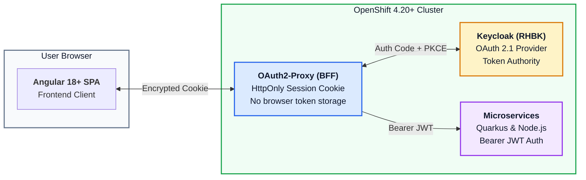

# Enterprise Angular 18+ Single Page Application (OAuth 2.1 & BFF)

This module demonstrates the recommended OAuth 2.1 architecture for frontend Single Page Applications (SPAs) on OpenShift.

---

## 1. Security Architecture: PKCE vs BFF Pattern



### Why OAuth 2.1 Bans Implicit Grant & ROPC
1. **No Tokens in URLs**: Implicit grant exposes access tokens in browser history and referrer headers.
2. **No Credential Harvesting**: Resource Owner Password Credentials (ROPC) teaches users to share their corporate passwords with client applications directly, bypassing MFA and conditional access.
3. **PKCE Mandatory**: Proof Key for Code Exchange (RFC 7636) prevents authorization code interception attacks.
4. **BFF Pattern Recommended**: Storing access tokens in browser memory/storage leaves them vulnerable to XSS. The Backend-For-Frontend (BFF) pattern maintains tokens in secure server-side sessions with encrypted `HttpOnly` cookies.

---

## 2. Running Locally

```bash
cd apps/angular-spa
npm install
npm start
```
Open `http://localhost:4200` to initiate the login flow against Keycloak.
