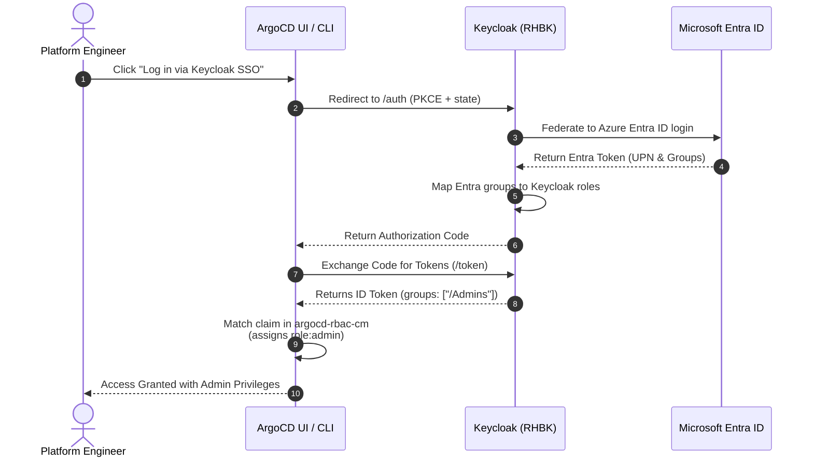

# ArgoCD OpenID Connect & RBAC Integration with Keycloak

This guide details how OpenShift GitOps / ArgoCD authenticates users against Red Hat Build of Keycloak using OpenID Connect (OIDC) and enforces Role-Based Access Control (RBAC) via Keycloak group memberships (which originate from Microsoft Entra ID or Active Directory).

---

## 1. Authentication & Authorization Flow



---

## 2. Configuration Steps

1. Apply the OIDC configuration patch to `argocd-cm`:
   ```bash
   oc patch configmap argocd-cm -n openshift-gitops --type merge -p "$(cat argocd-cm-patch.yaml)"
   ```
2. Apply the RBAC group mapping to `argocd-rbac-cm`:
   ```bash
   oc patch configmap argocd-rbac-cm -n openshift-gitops --type merge -p "$(cat argocd-rbac-cm.yaml)"
   ```
3. Restart ArgoCD server pod to refresh configuration:
   ```bash
   oc rollout restart deployment openshift-gitops-server -n openshift-gitops
   ```

---

## 3. RBAC Mapping Matrix

| Keycloak Group (from Entra/AD) | ArgoCD Role | Allowed Actions | Target Clusters |
| :--- | :--- | :--- | :--- |
| `/Admins` | `role:admin` | Full Admin (Create, Delete, Sync, Exec) | All Clusters |
| `/Platform-Engineers` | `role:admin` | Full Admin | All Clusters |
| `/Developers` | `role:developer` | Sync, Get, Logs, Exec (Dev/Stage only) | Dev & Stage |
| `/SecOps` | `role:readonly` | Read-only inspection | All Clusters |
