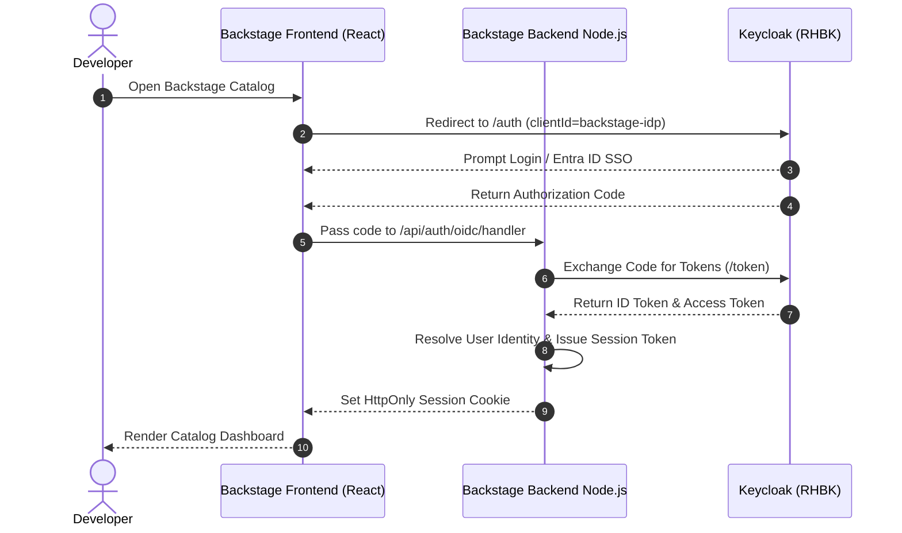

# Backstage IDP Authentication & User Sync via Keycloak

This module configures the Spotify Backstage Internal Developer Platform (IDP) running in OpenShift to authenticate developers via Red Hat Build of Keycloak using OpenID Connect (OIDC) with Authorization Code Flow and PKCE.

---

## 1. Authentication Architecture

---

## 2. Environment Variables Required

| Variable | Description | Example |
| :--- | :--- | :--- |
| `BACKSTAGE_CLIENT_SECRET` | Client Secret from Keycloak client `backstage-idp` | `s3cr3t-t0k3n` |
| `POSTGRES_HOST` | Backstage PostgreSQL host | `backstage-db.internal` |
| `AUTH_SESSION_SECRET` | Encryption secret for Backstage cookie sessions | `super-secure-key` |
