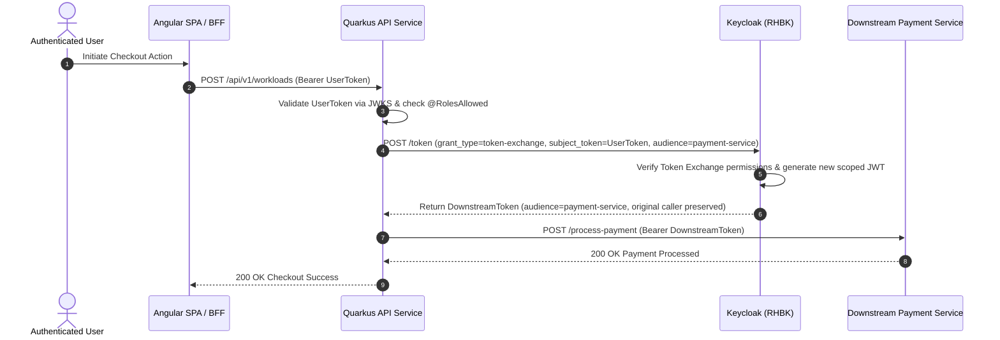

# Quarkus Microservice Resource Server & Token Exchange

This service demonstrates:
1. **OAuth 2.0 Resource Server**: Validating incoming JWTs from Keycloak against JWKS public keys.
2. **RBAC & Group Authorization**: Enforcing `@RolesAllowed` based on Keycloak / Entra ID group membership.
3. **RFC 8693 Token Exchange**: Securely exchanging an inbound client/user token for a downstream microservice token with scoped audience.

---

## 1. RFC 8693 Token Exchange Architecture



---

## 2. Build & Run

```bash
cd apps/microservices/quarkus-api-service
mvn quarkus:dev
```
Service starts on `http://localhost:8081`.
