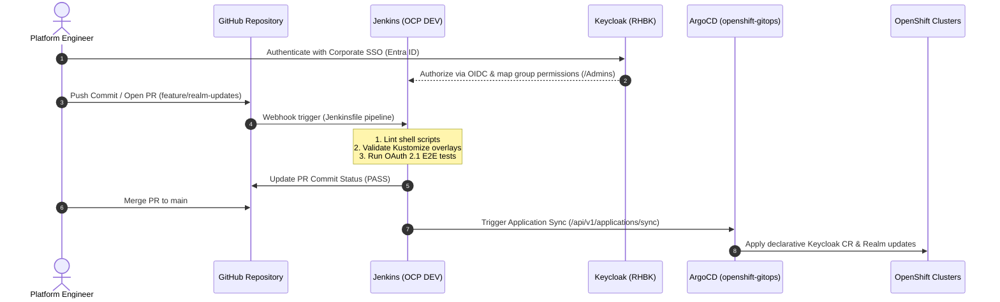

# Jenkins on OpenShift 4.20+ (Helm Chart, Keycloak OIDC & ArgoCD)

This directory provides the production configuration for deploying Jenkins on the **OpenShift DEV cluster (`cluster-alpha-dev`)** using the official Jenkins Helm Chart (`charts.jenkins.io/jenkins`), federating authentication with Keycloak OIDC, and triggering Continuous Delivery in ArgoCD / OpenShift GitOps.

---

## 1. CI/CD & GitOps Integration Workflow



---

## 2. Deploying Jenkins via Helm on OpenShift DEV

1. Add the official Jenkins Helm repository:
   ```bash
   helm repo add jenkins https://charts.jenkins.io
   helm repo update
   ```
2. Create the `ci-cd` namespace and grant necessary OpenShift Security Context Constraints (SCC):
   ```bash
   oc new-project ci-cd
   oc adm policy add-scc-to-user nonroot -z default -n ci-cd
   ```
3. Deploy Jenkins using the provided OpenShift-tailored values:
   ```bash
   helm upgrade --install jenkins jenkins/jenkins \
       -f ci-cd/jenkins/values-openshift.yaml \
       -n ci-cd
   ```
4. Configure the Keycloak client secret in the `ci-cd` namespace:
   ```bash
   oc create secret generic jenkins-keycloak-secret \
       --from-literal=KEYCLOAK_JENKINS_CLIENT_SECRET="CHANGE_ME_JENKINS_SECRET" \
       -n ci-cd
   ```
