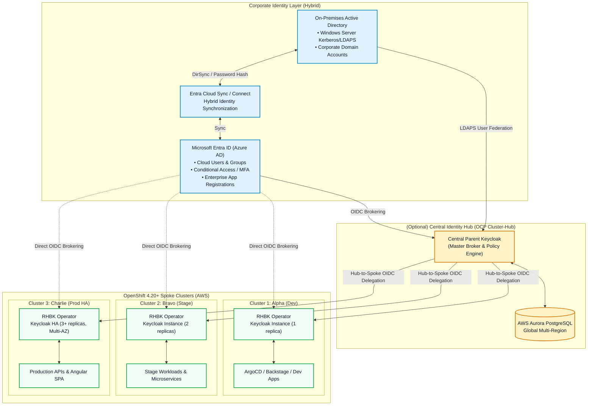

# Multi-Cluster Enterprise Architecture: Red Hat Build of Keycloak on OpenShift 4.20+

This document outlines the multi-cluster identity architecture deployed across 3 OpenShift Container Platform (OCP) 4.20+ clusters on AWS, integrated with Microsoft Entra ID (Azure AD), on-premises Active Directory, and an optional 4th Central Parent Hub Keycloak.

---

## 1. Global Multi-Cluster Topology

---

## 2. Topology Comparison & Architectural Trade-offs

| Topology Pattern | Deployment Mode | Description | Pros | Considerations |
| :--- | :--- | :--- | :--- | :--- |
| **Independent Multi-Cluster** | Spoke Clusters 1, 2, 3 connect directly to Entra ID | Each OpenShift cluster hosts its own RHBK instance with identical declarative realm imports | • Autonomous failure domains • Low latency (local cluster DB) • Simple GitOps reconciliation | Requires Entra ID redirect URI registration for each cluster route |
| **Hub-Spoke Hierarchical** | Cluster 4 acts as Parent Hub; Clusters 1-3 act as Spokes | The Parent Keycloak acts as the single federated IdP to Entra ID; spoke clusters federate to Parent Keycloak | • Single Entra ID App Registration • Centralized audit & session revocation • Standardized cross-cluster policies | WAN dependency on Hub cluster if offline caching is not enabled |
| **Cross-Site Replicated HA** | Multi-Region OpenShift with Infinispan Cross-Site | Active-Active Keycloak deployment with WAN state replication over JGroups RELAY2 | • Near-instant failover • Shared user sessions across regions | Complex networking (AWS Transit Gateway / Submariner) |

---

## 3. High Availability, Caching & Data Persistence

1. **Quarkus Runtime & Memory Footprint**:
   - RHBK uses the optimized Quarkus runtime, achieving sub-second startup times and lower memory footprint (~1.5 GB per pod vs ~3.5 GB in legacy WildFly RHSSO).
2. **Infinispan Distributed Caching**:
   - `sessions`, `authenticationSessions`, `offlineSessions`, `loginFailures`, `actionTokens` are distributed across pods with 2 owner copies (`owners=2`).
   - Discovery is managed natively via Kubernetes DNS ping (`jgroups.dns.query=keycloak-discovery.keycloak.svc`).
3. **Database Tier**:
   - High availability PostgreSQL 16 managed via Crunchy Data PGO with automated streaming replication across AWS availability zones and continuous WAL archiving to S3.
