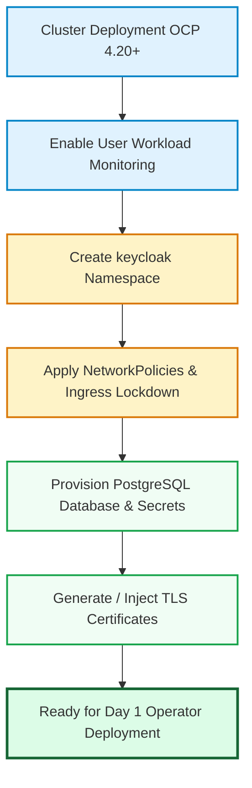

# Day 0: Infrastructure Prerequisites & AWS OpenShift Preparation

This runbook describes the Day 0 infrastructure, networking, certificate, and database requirements for deploying Red Hat Build of Keycloak across 3 OpenShift 4.20+ clusters on AWS.

---

## 1. Prerequisites Checklist

| Component | Specification | Deployment Method |
| :--- | :--- | :--- |
| **OpenShift Version** | 4.20+ (Kubernetes 1.31+) | AWS ROSA or IPI on AWS |
| **Database Tier** | PostgreSQL 16 (Multi-AZ HA) | Crunchy Data PGO / AWS RDS Aurora |
| **TLS Certificates** | TLS 1.3 / Valid CA certs | cert-manager / AWS ACM / OpenShift Ingress Router |
| **DNS Resolution** | Route53 Global Hosted Zone | AWS Route53 + Ingress Router records |
| **Monitoring** | User Workload Monitoring | OpenShift Cluster Monitoring Operator |

---

## 2. Day 0 Workflow Diagram



---

## 3. Execution Script

Run the automated Day 0 setup script:
```bash
./scripts/day0-prereqs.sh
```
This script handles namespace creation, monitoring labels, database secrets, and TLS certificate setup.
