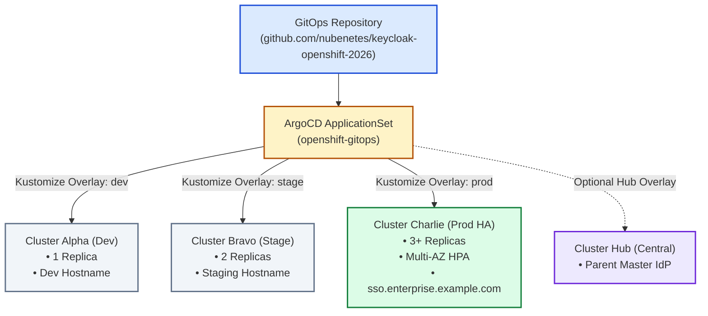

# Day 1: GitOps Provisioning & Operator Lifecycle

This runbook covers Day 1 deployment of the Red Hat Build of Keycloak Operator, Quarkus-based Keycloak custom resources, and declarative realm imports across development, staging, and production clusters.

---

## 1. GitOps Multi-Cluster Architecture



---

## 2. Operator Lifecycle & CR Management

The deployment utilizes the Red Hat Build of Keycloak Operator (`rhbk-operator`), which manages the full lifecycle of Keycloak instances via the Kubernetes Operator pattern:
- **Automatic Schema Migration**: The operator orchestrates Liquibase database schema migrations before starting new pods.
- **Infinispan Clustering**: Configures pod discovery and cluster forming via JGroups DNS_PING.
- **Declarative Realm Import**: Custom Resource `KeycloakRealmImport` reconciles realm configuration idempotently without manual UI intervention.

---

## 3. Deployment Commands

```bash
# Automated Day 1 Deployment for Dev
./scripts/day1-deploy-operator-and-keycloak.sh cluster-alpha-dev

# Automated Day 1 Deployment for Prod
./scripts/day1-deploy-operator-and-keycloak.sh cluster-charlie-prod
```
