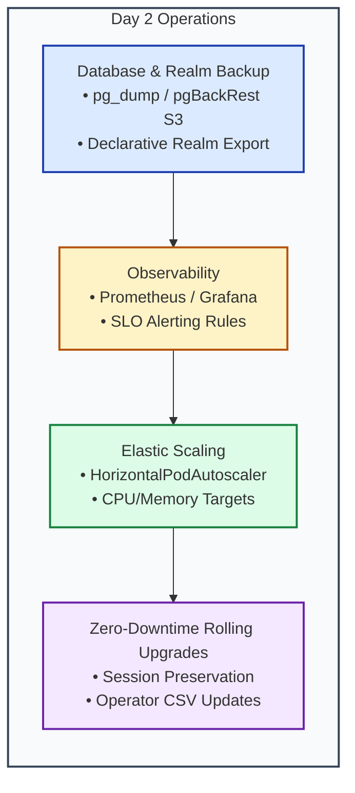

# Day 2: Operations, Maintenance, Monitoring & Disaster Recovery

This runbook describes day-to-day operations, declarative configuration updates, backups, monitoring, metrics, autoscaling, and zero-downtime upgrades.

---

## 1. Day 2 Operations Lifecycle



---

## 2. Backup & Disaster Recovery Runbook

1. **Automated Database Backup**:
   ```bash
   ./scripts/day2-operations-suite.sh backup-db
   ```
2. **Declarative Realm Configuration Export**:
   ```bash
   ./scripts/day2-operations-suite.sh export-realm
   ```
3. **Database Restore**:
   ```bash
   oc exec -i <db-pod> -n keycloak -- psql -U keycloak keycloak < /path/to/backup.sql
   ```

---

## 3. Observability & SLO Metrics

Key metrics exposed on port `9000/metrics`:
- `http_server_requests_seconds_count`: Total HTTP request count by status code and URI.
- `agroal_active_count` / `agroal_max_count`: Active and maximum database connection pool size.
- `jvm_memory_used_bytes{area="heap"}`: JVM heap utilization.
- `keycloak_logins_total`: Successful logins by realm and client.
- `keycloak_login_errors_total`: Failed login attempts (monitors brute-force attacks).
