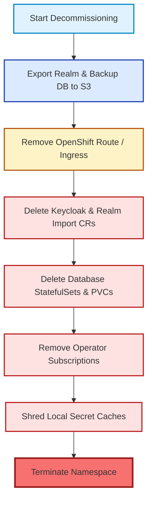

# Decommissioning & Cluster Teardown Runbook

This runbook outlines the steps for safely decommissioning a Keycloak deployment on OpenShift without leaving orphaned DNS records, cloud storage artifacts, or sensitive credentials.

---

## 1. Decommissioning Procedure Workflow



---

## 2. Automated Decommissioning Script

Execute the interactive teardown script:
```bash
./scripts/decommission-cluster.sh
```
To run non-interactively in automated CI/CD pipelines:
```bash
./scripts/decommission-cluster.sh --force
```
