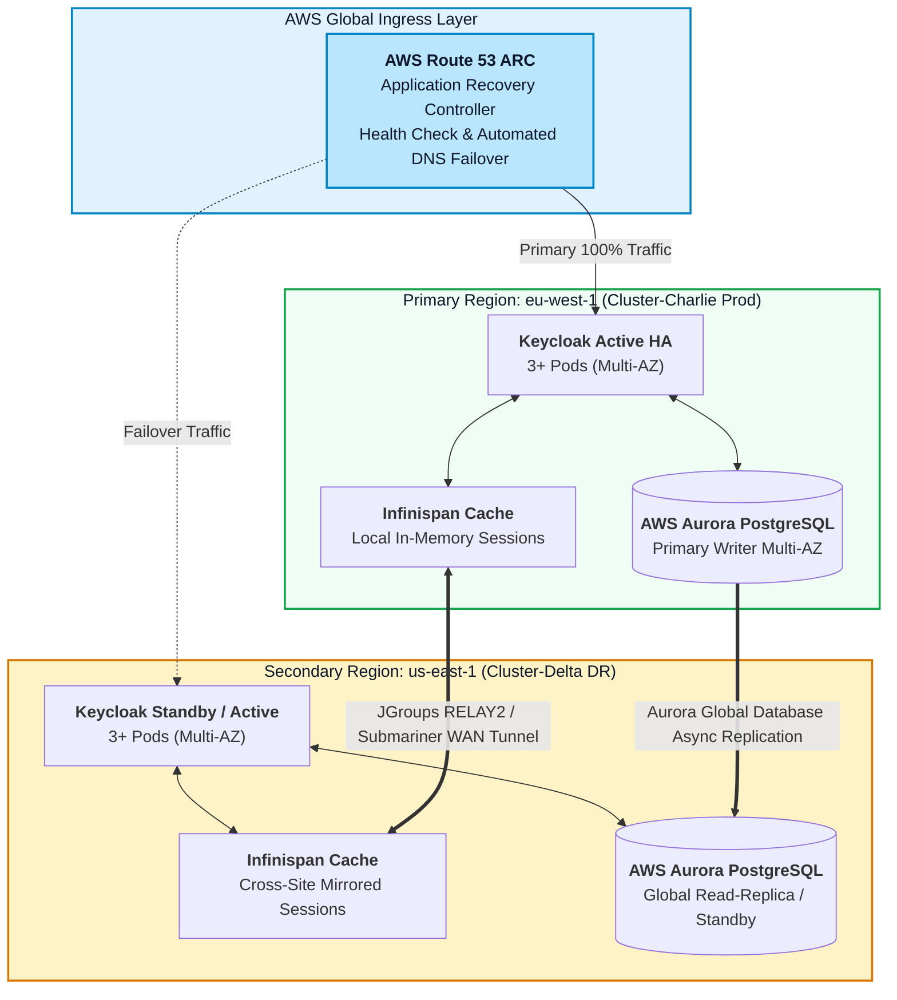

# Disaster Recovery & Cross-Site WAN Replication Guide (2026 Enterprise)

This document details the Disaster Recovery (DR) and Cross-Site WAN Replication strategy for Red Hat Build of Keycloak across multi-region OpenShift 4.20+ clusters on AWS (e.g., Primary Region `eu-west-1` and Secondary Region `us-east-1`).

---

## 1. Multi-Region Disaster Recovery Topologies



---

## 2. DR Architecture Comparison

| Model | Active-Active Cross-Site | Active-Passive (Warm Standby) | Pilot Light / Backup Restore |
| :--- | :--- | :--- | :--- |
| **RPO (Data Loss)** | Near Zero (< 1 sec) | Near Zero (< 5 sec) | RPO: 1 hour |
| **RTO (Recovery Time)** | **Instant (< 5 sec)** via DNS health checks | **< 2 minutes** (Promote Aurora DB) | **< 30 minutes** (Restore from S3) |
| **Session Preservation** | Yes (Live synchronized sessions) | Yes (If Cross-Site cache is enabled) | No (Users must re-authenticate) |
| **Infrastructure Cost** | High (2 full active clusters) | Medium (Minimal standby pods) | Low (No standby pods running) |

---

## 3. Failover & Failback Procedures

### Initiating Region Failover
1. **Promote Secondary Aurora Database**:
   ```bash
   aws rds failover-global-cluster \
       --global-cluster-identifier enterprise-keycloak-global-db \
       --target-db-cluster-identifier-arn arn:aws:rds:us-east-1:123456789012:cluster:keycloak-dr-cluster
   ```
2. **Switch Route 53 ARC Routing Control**:
   ```bash
   aws route53-recovery-control-config update-routing-control-states \
       --routing-control-states-entries "[{\"RoutingControlArn\":\"arn:aws:route53-recovery-control::123:control/primary\",\"RoutingControlState\":\"Off\"},{\"RoutingControlArn\":\"arn:aws:route53-recovery-control::123:control/secondary\",\"RoutingControlState\":\"On\"}]"
   ```
3. **Verify DR Cluster Health**:
   ```bash
   curl -sk "https://sso-dr.enterprise.example.com/health/ready" | jq .
   ```
