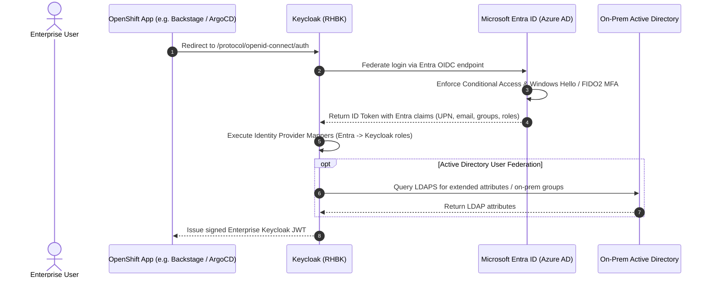

# Microsoft Entra ID (Azure AD) & Active Directory Federation Guide

This guide details how to integrate Red Hat Build of Keycloak with **Microsoft Entra ID** (via OpenID Connect Identity Brokering) and **Active Directory** (via LDAPS User Federation).

---

## 1. Microsoft Entra ID App Registration

1. Navigate to **Microsoft Entra Admin Center** > **App registrations** > **New registration**.
2. Set the application name: `Keycloak-Enterprise-SSO`.
3. Select Supported account types: `Accounts in this organizational directory only (Single tenant)`.
4. Configure Redirect URI (Web):
   - `https://sso.enterprise.example.com/realms/enterprise/broker/azure-entra-id/endpoint`
   - `https://keycloak-dev.apps.cluster-alpha.aws.enterprise.com/realms/enterprise/broker/azure-entra-id/endpoint`
5. Generate a **Client Secret** under **Certificates & secrets**.
6. Configure API Permissions:
   - Microsoft Graph: `openid`, `profile`, `email`, `User.Read`, `GroupMember.Read.All` (Application permission for background group syncing).

---

## 2. Federation Identity Flow

---

## 3. Active Directory LDAPS Configuration

Keycloak provides native LDAP integration with Active Directory supporting:
- **Connection**: `ldaps://ad.enterprise.corp:636` with Truststore SPI validation.
- **Sync Modes**:
  - `READ_ONLY`: User modifications in Keycloak are blocked; AD remains the single source of truth.
  - `SYNC`: Periodic background sync (Periodic Full Sync: every 24h; Periodic Changed Users: every 1h).
- **Group LDAP Mapper**: Maps AD Security Groups (`OU=SecurityGroups`) directly to Keycloak Groups and Realm Roles.
