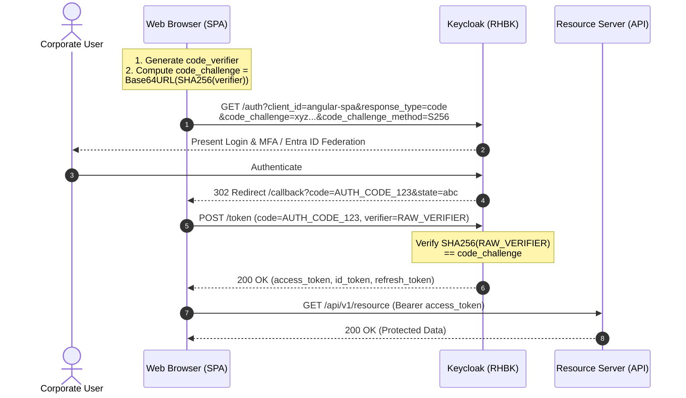
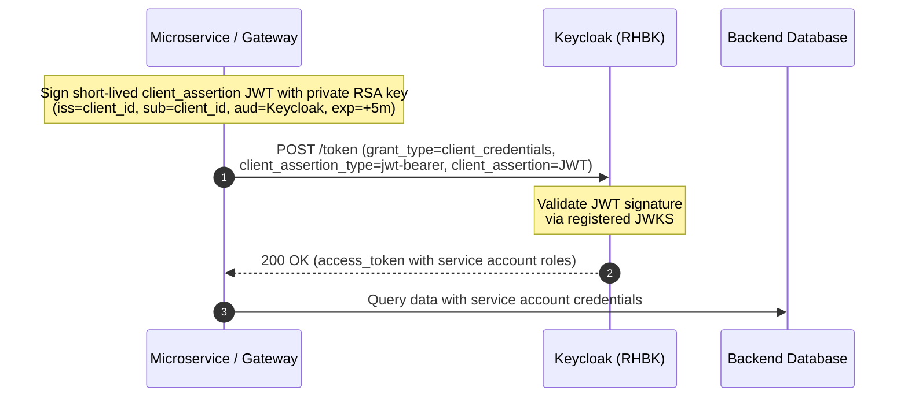
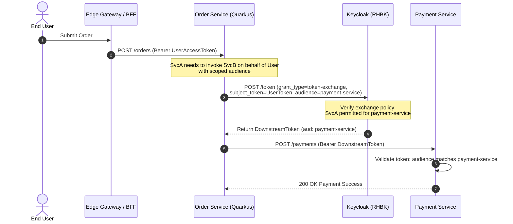

# OAuth 2.1 & OpenID Connect Security Patterns (2026 Recommended)

This document details the OAuth 2.1 and OpenID Connect (OIDC) security flows implemented in this repository, contrasting deprecated legacy flows against hardened modern standards.

---

## 1. OAuth 2.1 Paradigm Shift

| Feature / Flow | Legacy OAuth 2.0 (Deprecated / Prohibited) | Modern OAuth 2.1 (Enforced in this Repo) | Enterprise Rationale |
| :--- | :--- | :--- | :--- |
| **Implicit Grant** | ❌ Allowed (`response_type=token`) | 🚫 **STRICTLY PROHIBITED** | Access tokens are exposed in URI fragments, browser history, and HTTP Referrer headers. |
| **Resource Owner Password Credentials (ROPC)** | ❌ Allowed (`grant_type=password`) | 🚫 **STRICTLY PROHIBITED** | Directly handling credentials bypasses Multi-Factor Authentication (MFA), Conditional Access, and FIDO2/WebAuthn. |
| **Authorization Code Grant** | Optional PKCE | ✅ **PKCE MANDATORY (RFC 7636)** | Enforces cryptographic binding between authorization code and token request using `code_challenge_method=S256`. |
| **Single Page Apps (SPAs)** | LocalStorage / SessionStorage | ✅ **Backend-For-Frontend (BFF)** | Tokens remain on the server; the browser interacts via encrypted `HttpOnly`, `SameSite=Strict`, `Secure` cookies. |
| **Service-to-Service Auth** | Shared Client Secret | ✅ **Private Key JWT (RFC 7523) / mTLS** | Asymmetric cryptography ensures credentials cannot be extracted from configuration or stolen in transit. |
| **Multi-Tier Delegation** | Forwarding Raw User JWT | ✅ **Token Exchange (RFC 8693)** | Downstream services receive scoped tokens with explicit audience restriction while preserving audit trails. |

---

## 2. Flow 1: Authorization Code Flow with PKCE (Public Clients)

---

## 3. Flow 2: Service-to-Service Private Key JWT (RFC 7523)

---

## 4. Flow 3: RFC 8693 Token Exchange (Delegation & Impersonation)

