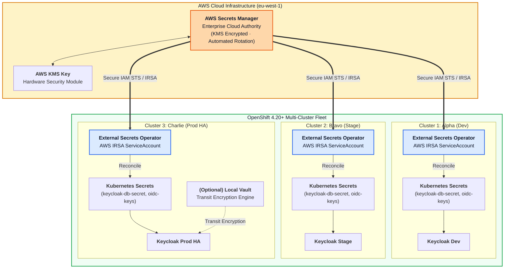

# Enterprise Secrets Management: AWS Secrets Manager vs. HashiCorp Vault Multi-Cluster Architecture

This architectural analysis evaluates secrets management strategies across 3 OpenShift Container Platform (OCP) clusters on AWS, specifically answering whether to synchronize HashiCorp Vault across clusters in a **Hub-Spoke topology** or maintain **independent in-cluster Vault instances / External Secrets Operator (ESO)**.

---

## 1. Secrets Management Architectural Decision Matrix

| Strategy | Architecture Model | Key Strengths | Operational Overhead | License Model | Recommended Use Case |
| :--- | :--- | :--- | :--- | :--- | :--- |
| **Strategy A: Cloud-Native ESO + AWS Secrets Manager** *(Recommended)* | AWS Secrets Manager acts as central root authority; ESO in each OCP cluster synchronizes secrets via AWS IRSA | • Zero cluster-hosted database state • Native AWS IAM & KMS encryption • Automated key rotation • Seamless OCP GitOps integration | **Very Low** (Managed AWS service + lightweight operator) | Standard AWS Pay-As-You-Go | **Best for AWS OpenShift Clusters (ROSA / IPI on AWS)** |
| **Strategy B: Central Hub Vault + Performance Replication (PR)** | Primary Vault cluster in AWS/Central region; Spoke Vaults in each OCP cluster replicating via WAN | • Centralized audit logs & access policies • Cross-cloud consistency • Dynamic secrets generation | **High** (Requires managing Raft consensus, unsealing, monitoring, WAN links) | Requires **HashiCorp Vault Enterprise** license for WAN PR | Large heterogeneous multi-cloud enterprises |
| **Strategy C: Per-Cluster Dedicated Vault + ESO Federation** | Lightweight in-cluster Vault (or Open-Source Vault) per OCP cluster; ESO synchronizes shared secrets from AWS Secrets Manager | • Local cluster autonomy • No cross-cluster network dependency • Supports local dynamic DB leasing & Transit encryption | **Medium** (Per-cluster Vault maintenance) | Open Source / Free | Teams needing local Vault Transit Encryption / Dynamic DB credentials without Enterprise license |

---

## 2. Recommended Architecture: Hybrid Cloud-Native (Strategy A + C)

---

## 3. Detailed Analysis: Should Vault Clusters be Synchronized as a Hub-Spoke?

### Why Hub-Spoke Vault Replication is Often an Anti-Pattern on AWS OpenShift
1. **License Constraint**: Native cross-cluster WAN synchronization in HashiCorp Vault (**Performance Replication**) is a proprietary feature restricted exclusively to **Vault Enterprise**. The open-source community edition does not support cross-cluster multi-primary replication.
2. **Network Resilience & Latency**: If a spoke OpenShift cluster relies on a remote parent Vault over WAN for token verification or secret leasing, network partitions or high latency directly degrade Keycloak and application startup times.
3. **Blast Radius & Operational Complexity**: Managing Raft consensus quorum across multiple Kubernetes clusters introduces operational overhead (split-brain recovery, leader elections, unseal key distribution).

### The Recommended Modern Approach (2026)
1. **Source of Truth**: Keep static and root credentials (Entra ID Client Secret, Active Directory Bind Credentials, Database Master Passwords) in **AWS Secrets Manager** with KMS encryption.
2. **Cluster Ingestion**: Deploy **External Secrets Operator (ESO)** on each OpenShift cluster. ESO authenticates via **AWS IAM Roles for Service Accounts (IRSA)**, eliminating long-lived AWS access keys.
3. **Optional Local Vault Instances**: If workloads require advanced Vault capabilities (such as dynamic PostgreSQL credential generation or encryption-as-a-service via the Transit engine), deploy a standalone, autonomous Vault instance per cluster without WAN replication dependencies.
